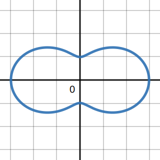
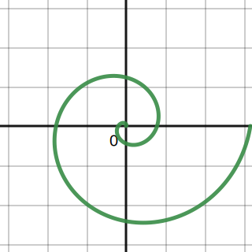

$$
    % Differentials d[something]/d[something]
    \gdef\diff#1#2{\frac{\mathrm{d}#1}{\mathrm{d}#2}}
    % Shortcut for dy/dx
    \gdef\dydx{\diff{y}{x}}
    % Differential letter "d" with a thin space before it
    \gdef\dd{\mathop{}\!\mathrm{d}}
    % Shortcut for not implies
    \gdef\nimplies{\;\;\;\not\nobreak\!\!\!\!\implies\;}
    % Shortcuts for extended brackets
    \gdef\({\left(} \gdef\){\right)}
    \gdef\[{\left[} \gdef\]{\right]}
    % Shortcut for real number symbol
    \gdef\R{\mathbb{R}}
    % More spacing between lines in arrays (override by using \[5em])
    \gdef\arraystretch{2.2em}
$$

# Homework 11

**Mos Kullathon**
921425216

## 1(a) Find $\frac{\dd y}{\dd x}$ and $\frac{\dd^2y}{\dd x^2}$ for the following parametrized curve:

### (i) $x=\sec t, y=\tan t$

$$
x = \sec t \implies \frac{\dd x}{\dd t} = \sec t\tan t \\
y = \tan t \implies \frac{\dd y}{\dd t} = \sec^2 t \\
\therefore\frac{\dd y}{\dd x}
= \frac{\sec^2t}{\sec t\tan t}
=\frac{\sec t}{\tan t}
=\frac{1}{\cos t}\frac{\cos t}{\sin t}
=\frac{1}{\sin t}
=\csc t \\
\implies\frac{\dd^2y}{\dd x^2}
=\frac{\frac{\dd}{\dd t}\csc t}{\sec t\tan t}
=-\frac{\cos t}{\sin^2 t\sec t\tan t}
=-\frac{\cos^2 t}{\sin^2 t\tan t}
=-\cot^3 t
$$

### (ii) $x=2t^2, y=t^4$

$$
x = 2t^2 \implies \frac{\dd x}{\dd t} = 4t \\
y = t^4 \implies \frac{\dd y}{\dd t} = 4t^3 \\
\therefore \frac{\dd y}{\dd x} = \frac{4t^3}{4t} = t^2 \\
\implies\frac{\dd^2 y}{\dd x^2}
=\frac{\frac{\dd}{\dd t}t^2}{4t}
=\frac{2t}{4t} = \frac{t}{2}
$$

## (b) For (i) above, find the equation of the tangent line at $\frac{\pi }{4}$

$$
\begin{align*}
    t=\frac{\pi}{4}
    &\implies
    \frac{\dd y}{\dd x} = \csc\frac{\pi}{4} = \sqrt{2} \\
    &\implies
    x=\sec\frac{\pi}{4} = \sqrt{2}\\
    &\implies
    y= \tan\frac{\pi}{4} = 1
\end{align*}
$$

Then, the equation of the tangent line to the curve at $\displaystyle t=\frac{\pi}{4}$ is
$$
y-1 = \sqrt{2}(x-\sqrt{2}) \\
y = \sqrt{2}x + 3.
$$

## 2. Find the arc length of the curve $x=t^3, y=\frac{3t^2}{2}$ when $0\le t\le\sqrt{3}$.

$$
x=t^3 \implies \frac{\dd x}{\dd t} = 3t^2 \\
y = \frac{3t^2}{2} \implies \frac{\dd y}{\dd t} = 3t
$$

The arc length $L$ of the curve for $0\le t\le\sqrt{3}$ is
$$
\begin{align*}
    L &= \int_0^{\sqrt{3}}\sqrt{(3t^2)^2+(3t)^2} \dd t \\
    &= \int_0^{\sqrt{3}}\sqrt{9t^4+9t^2} \dd t \\
    &= \int_0^{\sqrt{3}}\sqrt{9t^2(t^2+1)} \dd t \\
    &= 3\int_0^{\sqrt{3}}t\sqrt{t^2+1}\dd t
\end{align*}
\\
\begin{darray}{cc}
    u = t^2+1 &\implies& \dd u = 2t\dd t \\
    &\iff& \dd t = \frac{\dd u}{2t} \\
    t = 0 &\implies& u = 0^2+1=1 \\
    t = \sqrt{3} &\implies& u = \sqrt{3}^2 + 1 = 4
\end{darray}
\\
\begin{align*}
    L = 3\int_0^{\sqrt{3}}t\sqrt{t^2+1}\dd t
    &= 3\int_1^4 t\sqrt{u} \frac{\dd u}{2t} \\
    &= \frac{3}{2}\int_1^4 \sqrt{u}\dd u \\
    &= \frac{3}{2} \[\frac{2u^{3/2}}{3}\]_1^4 \\
    &= \frac{3}{2} \(\frac{16}{3}-\frac{2}{3}\) \\
    &= \frac{14}{2} \\
    &= 7.
\end{align*}
$$

## 3(a) Use Desmos to draw the graph $x(t)=\cos t, y(t)=\sin^3t$ for $-\pi\le t\le\pi$.

> ### (b) Find the area of the bounded region.
>
> $$
> \begin{darray}{cc}
>     x(t) = \cos t&\implies& x'(t)=-\sin t \\
>     y(t)=\sin^3 t &\implies& y'(t)=3\sin^2 t\cos t
> \end{darray}
> $$

> ### (c\) Find the volume of solid of revolution by revloving the curve along the y-axis.

### (d) Write down the arc length integral of this curve from $t=0$ to $t=\pi/2$.

$$
\begin{align*}
    L &= \int_0^\frac{\pi}{2} \sqrt{x'(t)^2+y'(t)^2}\dd t \\
    &= \int_0^\frac{\pi}{2}
    \sqrt{\sin^2 t + 9\sin^4 t\cos^2 t} \dd t \\
    &= \int_0^\frac{\pi}{2}
    \sqrt{\sin^2t(1+9\sin^2t\cos^2t)}\dd t
\end{align*}
$$

## 4. Convert the following points into polar coordinates:

### (a) $(-4,4)$

Point is in second quadrant.

$$
r = \sqrt{(-4)^2+4^2} = 4\sqrt{2} \\
\theta = \pi + \tan^{-1}(-1) = \frac{3\pi}{4} \\
\therefore (r,\theta) = \(4\sqrt{2}, \frac{3\pi}{4}\)
$$

### (b) $(3,3\sqrt{3})$

Point is in first quadrant.

$$
r=\sqrt{3^2+3^2\sqrt{3}^2} = 6 \\
\theta = \tan^{-1}\(\frac{3\sqrt{3}}{3}\) = \tan^{-1}\sqrt{3} = \frac{\pi}{3} \\
\therefore (r, \theta) = \(6, \frac{\pi}{3}\)
$$

### (c\) $(\sqrt{3}, -1)$

Point is in fourth quadrant.

$$
r = \sqrt{\sqrt{3}^2 + (-1)^2} = 2 \\
\theta = \tan^{-1}\(\frac{-1}{\sqrt{3}}\) = -\frac{\pi}{6} \\
\therefore (r,\theta) = \(2, -\frac{\pi}{6}\)
$$

### (d) $(-6,0)$

Point is on the x-axis.

$$
r = \sqrt{(-6)^2+0^2} = 6 \\
\theta =\pi \\
\therefore (r,\theta) = (6,\pi)
$$

## 5. Consider the polar equation $r=2+\cos(2\theta)$.

### (a) Use Desmos to sketch the picture.

### (b) Find the slope of the tangent line at $\theta=\pi/4$.

For $r=f(\theta)=2+\cos(2\theta)$, its parametrized form $(x(\theta),y(\theta))$, where:

For $r=f(\theta)$ where $f(\theta)=2+\cos(2\theta)$.

$$
\begin{align*}
    x(\theta) &= f(\theta)\cos\theta \\
    &= (2+\cos(2\theta))\cos\theta \\
    &= 2\cos\theta+\cos(2\theta)\cos\theta \\
    y(\theta) &= f(\theta)\sin\theta \\
    &= (2+\cos(2\theta))\sin\theta \\
    &= 2\sin\theta + \sin\theta\cos(2\theta).
\end{align*}
$$

Then,
$$
x'(\theta) = -2\sin\theta-2\sin(2\theta)\cos\theta-\cos(2\theta)\sin\theta \\
y'(\theta) = 2\cos\theta+\cos\theta\cos(2\theta)-2\sin\theta\sin(2\theta).
$$

So at $\displaystyle\theta = \frac{\pi}{4}$,
$$
\frac{\dd y}{\dd x} = \frac{y'(\frac{\pi}{4})}{x'(\frac{\pi}{4})}
=\frac
{2\cos\frac{\pi}{4}+\cos\frac{\pi}{4}\cos(2\frac{\pi}{4})-2\sin\frac{\pi}{4}\sin(2\frac{\pi}{4})}{-2\sin\frac{\pi}{4}-2\sin(2\frac{\pi}{4})\cos\frac{\pi}{4}-\cos(2\frac{\pi}{4})\sin\frac{\pi}{4}}
=\frac{0}{-2\sqrt{2}}
=0.
$$

> ### (c\) Find the area of the bounded region of the graph.

> ## 6. Consider the polar equation $r=\theta^2$.

> ### (a) Use Desmos to sketch the picture for $0\le\theta\le4\pi$.
> 

>
> 
>
> 

> ### (b) Find the slope of the tangent line at $\theta=3\pi/4$.

> ### (c\) Find the arc length of the curve for $0\le\theta\le4\pi$.
