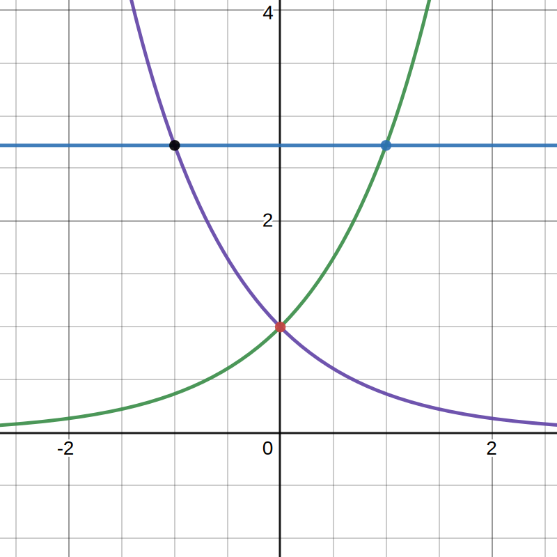
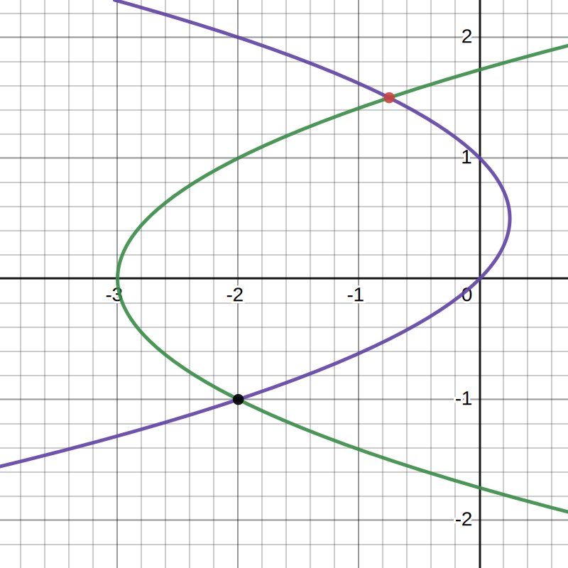
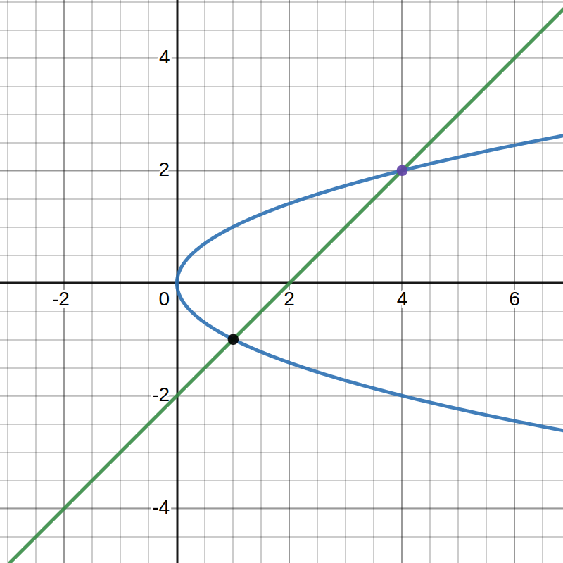

# Homework 3

$$
    % Differentials d[something]/d[something]
    \gdef\diff#1#2{\frac{\mathrm{d}#1}{\mathrm{d}#2}}
    % Shortcut for dy/dx
    \gdef\dydx{\diff{y}{x}}
    % Differential letter "d" with a thin space before it
    \gdef\dd{\mathop{}\!\mathrm{d}}
    % Shortcut for not implies
    \gdef\nimplies{\;\;\;\not\nobreak\!\!\!\!\implies\;}
    % Shortcuts for extended brackets
    \gdef\({\left(} \gdef\){\right)}
    \gdef\[{\left[} \gdef\]{\right]}
    % Shortcut for real number symbol
    \gdef\R{\mathbb{R}}
    % More spacing between lines in arrays (override by using \[5em])
    \gdef\arraystretch{2em}
$$

**Mos Kullathon**
921425216

## 1. Find the area of the bounded region enclosed by $y = x^2 , x + y = 2$.

$$
\begin{darray}{c}
    y = x^2 &\implies& f(x) = x^2
    \\
    x + y = 2 &\implies& g(x) = 2-x
\end{darray}
$$

Finding intersections of $f$ and $g$.
$$
    x^2 = 2 - x
    \\
    x^2 + x - 2 = 0
    \\
    (x-1)(x+2) = 0
    \\
    \therefore x = -2, 1
$$

Since $g(x) \ge f(x)$ for $x \in [-2, 1]$, the area between the curves is:
$$
\begin{align*}
    \int_1^{-2} g(x)-f(x) \dd x
    &= \int_1^{-2} (2-x-x^2) \dd x
    \\
    &= \bigg[2x - \frac{x^2}{2} - \frac{x^3}{3}\bigg]_1^{-2}
    \\
    &= \frac{9}{2}.
\end{align*}
$$

## 2. Find the area of the region enclosed by $y=\tan x$ and the x-axis over the interval $[-\pi/3, \pi/4]$.

Since $\tan x \le 0$ for $x = 2\pi n + \pi$ where $n \in \Z$, we find that for values of $x\in [-\frac{\pi}{3}, \frac{\pi}{4}]$:

$$
\tan x \le 0, \qquad x \in \[-\frac{\pi}{3}, 0\]
\\
\tan x \ge 0, \qquad x\in \[0, \frac{\pi}{4}\]
$$

As such, the total area of $y=\tan x$ bounded by the x-axis over $[-\frac{\pi}{3}, \frac{\pi}{4}]$ is:

$$
\begin{align*}
    &-\int_{-\pi/3}^0 \tan x \dd x + \int_0^{\pi/4} \tan x \dd x
    \\
    &= - \bigg[-\ln\cos x\bigg]_{-\pi/3}^0 + \bigg[-\ln\cos x\bigg]_0^{\pi/4}
    \\
    &= \frac{3\ln 2}{2}.
\end{align*}
$$

## 3. Find the area of the shaded region.

$$
\begin{darray}{c}
    x = (y-1)^2 &\implies& y = \sqrt x - 1
    \\
    x = 3 - y &\implies& y = 3 - x
    \\
    x = 2\sqrt{y} &\implies& y = \frac{1}{4}x^2
\end{darray}
$$

$\sqrt{x}-1 \ge \frac{1}{4}x^2$ for $x\in[0, 1]$. As such the area from $x=0$ to $x=1$ is:

$$
\int_0^1 (\sqrt{x}+1-\frac{1}{4}x^2) \dd x.
$$

$3-x \ge \frac{1}{4}x^2$ for $x\in[1, 2]$. As such the area from $x=1$ to $x=2$ is:

$$
\int_1^2 (3-x-\frac{1}{4}x^2)\dd x.
$$

Therefore, the area $A$ between the three functions from $x=0$ to $x=1$ is the sum of the two integrals.

$$
\begin{align*}
    A &=
    \int_0^1 (\sqrt{x}+1-\frac{1}{4}x^2) \dd x + \int_1^2 (3-x-\frac{1}{4}x^2)\dd x
    \\
    &= \bigg[\frac{2x^{3/2}}{3}+x-\frac{x^3}{12}\bigg]_0^1 + \bigg[3x-\frac{x^2}{2}-\frac{x^2}{12}\bigg]_1^2
    \\
    &= \frac{19}{12} + \frac{10}{3} - \frac{29}{12}
    \\
    &= \frac{5}{2}
\end{align*}
\\
$$

## 4. Book Section 2.1

### (2) Area between $y=x^2$ and $y=3x+4$.

$$
x^2 = 3x + 4
\\
x^2 - 3x - 4 = 0
\\
(x-4)(x+1) = 0
\\
\therefore x = -1, 4
$$

$y=x^2$ and $y=3x+4$ intersects at $x = -1$ and $x = 4$, and $3x+4 \ge x^2$ for all $x\in[-1, 4]$. Therefore,

$$
\begin{align*}
    A &= \int_{-1}^4 3x+4-x^2 \dd x
    \\
    &= \[\frac{3x^2}{2}+4x-\frac{x^3}{3}\]_{-1}^4
    \\
    &= \frac{125}{6}.
\end{align*}
$$

### (3) Area between $y=x^3$ and $y=x^2+x$.

$$
x^3 = x^2 + x
\\
x^3 - x^2 - x = 0
\\
\therefore x = \frac{1}{2}\pm\frac{\sqrt{5}}{2}
$$

$y=x^3$ and $y=x^2+x$ intersects at $x = \frac{1-\sqrt{5}}{2}$ and $x=\frac{1+\sqrt{5}}{2}$.

$0 \ge x^3 \ge x^2 + x$ for all $x\in[\frac{1-\sqrt{5}}{2},0]$ and $x^2 + x \ge x^3 \ge 0$ for all $x\in[0,\frac{1+\sqrt{5}}{2}]$. Therefore,

$$
\begin{align*}
    A &= \int_\frac{1-\sqrt{5}}{2}^0 (x^3 - x^2 - x) \dd x
    + \int_0^{\frac{1+\sqrt{5}}{2}} (x^2 + x - x^3) \dd x
    \\
    &= \[\frac{x^4}{4} - \frac{x^3}{3} - \frac{x^2}{2}\]_\frac{1-\sqrt{5}}{2}^0 + \[\frac{x^3}{3} + \frac{x^2}{2} - \frac{x^4}{4}\]_0^{\frac{1+\sqrt{5}}{2}}
    \\
    &= \frac{13}{12}.
\end{align*}
$$

### (12) Area between $y=e$, $y=e^x$, and $y=e^{-x}$.

$$
e = e^x \implies x = 1
\\
e = e^{-x} \implies x = -1
\\
\therefore x = \pm1
$$

|                                               |                                                     |
| --------------------------------------------- | --------------------------------------------------- |
|  | $e = e^x$ at $x = 1$ and $\\e = e^{-x}$ at $x = -1$ |

$$
\begin{align*}
    \displaystyle\therefore A &= \int_{-1}^0e-e^{-x}\dd x + \int_0^1 e-e^x\dd x
    \\
    &= \bigg[ex+e^{-x}\bigg]_{-1}^0 + \bigg[ex - e^x\bigg]_0^1
    \\
    &= 2
\end{align*}
$$

### (22) Area between $x=-3+y^2$ and $x=y-y^2$.

$$
-3+y^2 = y - y^2
\\
2y^2-y-3 = 0
\\
\therefore y=-1,\frac{3}{2}
$$

|                                             |                                                                  |
| ------------------------------------------- | ---------------------------------------------------------------- |
|  | $-3+y^2 = y - y^2\\$ at $y=-1$ and $\displaystyle y=\frac{3}{2}$ |

$$
\begin{align*}
    \therefore A &= \int_{-1}^{3/2} y-y^2-(-3+y^2) \dd y
    \\
    &= \int_{-1}^{3/2}-2y^2+y+3 \dd y
    \\
    &= \bigg[-\frac{2y^3}{3} + \frac{y^2}{2} + 3y \bigg]_{-1}^{3/2}
    \\
    &= \frac{125}{24}
\end{align*}
$$

### (53) Area between $y^2 = x$ and $x=y+2$.

$$
y^2 = y + 2
\\
y^2 - y - 2 = 0
\\
(y+1)(y-2) = 0
\\
\therefore y=-1,2
$$

|                                             |                                               |
| ------------------------------------------- | --------------------------------------------- |
|  | $y^2=y+2\\$ at $\displaystyle y=-1$ and $y=2$ |

$$
\begin{align*}
    \therefore A &= \int_{-1}^2 y+2-y^2 \dd y
    \\
    &= \bigg[\frac{y^2}{2}+2y-\frac{y^3}{3}\bigg]_{-1}^2
    \\
    &= \frac{9}{2}
\end{align*}
$$
